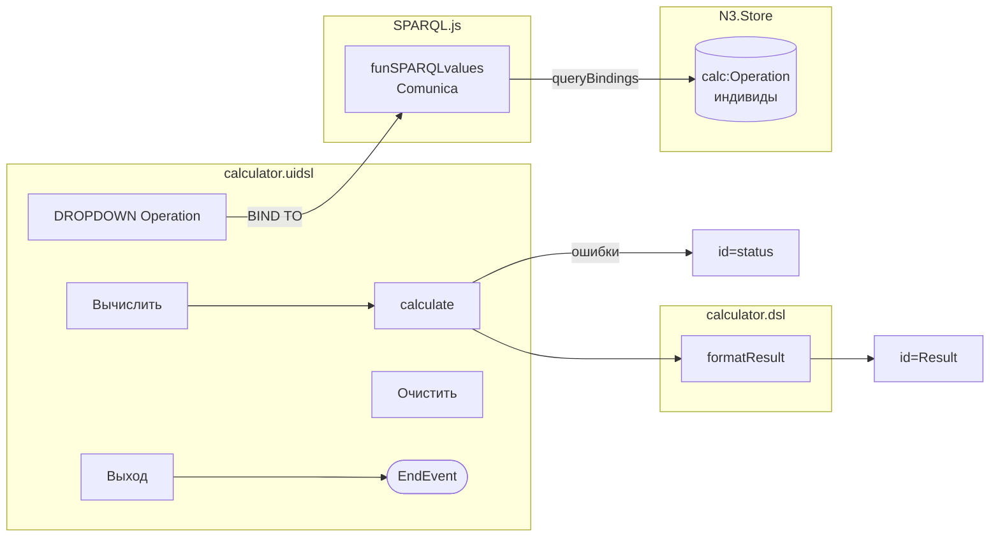

# Построение калькулятора с помощью DSL1 (ver2_1a)

## Пошаговое руководство

*Аналог «Hello, Calculator» из BPMN Runa WFE, упрощённая версия ver2_1a.*

---

## Содержание

1. [Предварительные требования](#1-предварительные-требования)
2. [Структура проекта](#2-структура-проекта)
3. [Отличия от ver2 (ver2_1a)](#3-отличия-от-ver2-ver2_1a)
4. [Онтологии](#4-онтологии)
5. [Код на DSL — модуль ИНИЦИАЛИЗАЦИЯ](#5-код-на-dsl--модуль-инициализация)
6. [Код на DSL — модуль ВЫЧИСЛЕНИЕ](#6-код-на-dsl--модуль-вычисление)
7. [UI DSL](#7-ui-dsl)
8. [Схема алгоритма (Mermaid)](#8-схема-алгоритма-mermaid)
9. [Итоговые файлы calculator.html и calculator_DSL1.html](#9-итоговые-файлы)
10. [Развёртывание на GitHub Pages](#10-развёртывание-на-github-pages)
11. [Устранение проблем](#11-устранение-проблем)
12. [Отличия comunica-browser.js от n3.min.js](#12-отличия-comunica-browserjs-от-n3minjs)
13. [Трансляция DSL1 в JavaScript](#13-трансляция-dsl1-в-javascript)

---

## 1. Предварительные требования

Для работы с ver2_1a **не требуется** Node.js или любой сервер.
Весь код — браузерный JavaScript, готовый к размещению на GitHub Pages.

| Инструмент | Назначение |
|-----------|-----------|
| Браузер (Chrome, Firefox, Edge) | Запуск и тестирование |
| Git | Контроль версий и публикация |
| Текстовый редактор | Правка .dsl, .uidsl, .html, .ttl |

Внешние библиотеки подключаются через CDN в HTML-файле (порядок важен!):

```html
<!-- N3.js — парсинг RDF/Turtle и quadStore -->
<script src="https://unpkg.com/n3@1.17.2/browser/n3.min.js"></script>
<!-- Comunica — полный движок SPARQL 1.1 для браузера -->
<script src="https://rdf.js.org/comunica-browser/versions/v4/engines/query-sparql-rdfjs/comunica-browser.js"></script>
<!-- SPARQL.js — модуль funSPARQLvalues (единственное место использования Comunica) -->
<script src="SPARQL.js"></script>
```

---

## 2. Структура проекта

```
ver2/
├── ontology/
│   ├── dsl1_ontology.ttl          ← базовая онтология языка DSL1
│   └── calculator_ontology.ttl    ← онтология задачи Калькулятор
└── examples/
    └── calculator/
        ├── calculator.dsl          ← логика на PL/SPARQL DSL
        ├── calculator.uidsl        ← описание интерфейса
        ├── calculator.html         ← калькулятор (браузерный JS)
        ├── calculator_DSL1.html    ← калькулятор + DSL1-консоль
        ├── SPARQL.js               ← модуль funSPARQLvalues (Comunica)
        ├── BPMN_converter.md       ← схема конвертации DSL1 → BPMN 2.0
        └── instructions.md         ← это руководство
```

---

## 3. Отличия от ver2 (ver2_1a)

| Возможность | ver2 | ver2_1a |
|-------------|------|---------|
| SPARQL-движок | Нет (только API N3) | Comunica SPARQL 1.1 через SPARQL.js |
| `funSPARQLvalues` | Не реализована | Реализована в SPARQL.js |
| Онтологии | Встроены в HTML как строка | Внешние .ttl файлы в ver2/ontology/ |
| Базовая онтология DSL1 | Нет | `dsl1_ontology.ttl` |
| Онтология калькулятора | Встроена в HTML | `calculator_ontology.ttl` |
| ID полей ввода | `operand1`, `operand2`, `operationType` | `Input1`, `Input2`, `Operation` |
| Метки полей | «Первое число» | «Первое число (Input1)» |
| Тип полей ввода | `type=number` (со стрелками!) | `type=text` + числовой фильтр (без стрелок) |
| Поле ошибок | В поле Result | Отдельное поле `id=status` |
| Кнопка Выход | Нет | Есть (явный EndEvent BPMN) |
| DSL1-консоль | Нет | `calculator_DSL1.html` с тремя вкладками |
| Документация BPMN | Нет | `BPMN_converter.md` |
| Модуль WORKFLOW в .dsl | Нет | Есть (раздел 0 с BPMN-аннотациями) |

---

## 4. Онтологии

### 4.1 Базовая онтология DSL1 (`dsl1_ontology.ttl`)

Определяет сам язык DSL1: типы полей, встроенные функции, привязки к BPMN 2.0.

Ключевые элементы:

| Элемент | Тип | Назначение |
|---------|-----|-----------|
| `dsl1:NumberField` | Класс | Тип числового поля ввода |
| `dsl1:DropdownField` | Класс | Тип выпадающего списка |
| `dsl1:StatusField` | Класс | Тип поля статуса (только для ошибок) |
| `dsl1:funSPARQLvalues` | Индивид | Описание функции funSPARQLvalues |
| `dsl1:dslConnection` | Свойство | Связь поля с .dsl файлом |
| `dsl1:uidslConnection` | Свойство | Связь поля с .uidsl файлом |
| `dsl1:bpmnElement` | Свойство | Соответствие элементу BPMN 2.0 |

### 4.2 Онтология калькулятора (`calculator_ontology.ttl`)

Определяет прикладную модель задачи «Калькулятор».

Импортирует `dsl1_ontology.ttl`.

Четыре операции (тип `calc:Operation`):

| Индивид | `operationName` | `operationSymbol` | `operationLabel` | `dsl:order` |
|---------|-----------------|-------------------|------------------|-------------|
| `calc:addOperation` | `"add"` | `"+"` | `"Сложение"` | `1` |
| `calc:subtractOperation` | `"subtract"` | `"-"` | `"Вычитание"` | `2` |
| `calc:multiplyOperation` | `"multiply"` | `"*"` | `"Умножение"` | `3` |
| `calc:divideOperation` | `"divide"` | `"/"` | `"Деление"` | `4` |

Поля интерфейса с BPMN-привязками:

| Индивид | Тип | id в HTML | BPMN элемент |
|---------|-----|-----------|--------------|
| `calc:Input1` | `dsl1:NumberField` | `Input1` | `UserTask` |
| `calc:Input2` | `dsl1:NumberField` | `Input2` | `UserTask` |
| `calc:OperationField` | `dsl1:DropdownField` | `Operation` | `ServiceTask` |
| `calc:ResultField` | `dsl1:ReadonlyField` | `Result` | `DataObject` |
| `calc:StatusField` | `dsl1:StatusField` | `status` | `DataObject` |

---

## 5. Код на DSL — модуль ИНИЦИАЛИЗАЦИЯ

Модуль ИНИЦИАЛИЗАЦИЯ содержит функцию `getOperations()`.
Вызывается **один раз** при загрузке страницы.
Использует `funSPARQLvalues` для получения операций через Comunica SPARQL.

```dsl
// Модуль 0: WORKFLOW → ServiceTask: Загрузка операций
FUNCTION getOperations() {
  let sparql = "
    PREFIX calc: <https://github.com/bpmbpm/DSL1/ontology/calculator#>
    PREFIX dsl:  <https://github.com/bpmbpm/DSL1/ontology#>
    SELECT ?label ?symbol ?labelRu ?orderVal WHERE {
      ?op a calc:Operation ;
          calc:operationName   ?label ;
          calc:operationSymbol ?symbol ;
          calc:operationLabel  ?labelRu ;
          dsl:order            ?orderVal .
    }
    ORDER BY ASC(?orderVal)
  "
  // funSPARQLvalues(currentStore, SPARQL) → Promise<Array>
  return funSPARQLvalues(currentStore, sparql)
}
```

---

## 6. Код на DSL — модуль ВЫЧИСЛЕНИЕ

### FUNCTION calculate

```dsl
// [BPMN: ServiceTask + ExclusiveGateway × 3]
FUNCTION calculate(Input1, Input2, operationType) {

  // Проверка полей (→ id=status при ошибке)
  la-if (Input1 === "" || Input2 === "") {
    return ERROR "Ошибка: введите оба числа"
  }
  la-if (operationType === "") {
    return ERROR "Ошибка: выберите операцию"
  }

  // Диспетчеризация
  la-if (operationType === "add")      { return Input1 + Input2 }
  la-if (operationType === "subtract") { return Input1 - Input2 }
  la-if (operationType === "multiply") { return Input1 * Input2 }
  la-if (operationType === "divide") {
    la-if (Input2 === 0) {
      return ERROR "Ошибка: деление на ноль"
    }
    return Input1 / Input2
  }

  return ERROR "Ошибка: неизвестная операция: " + operationType
}
```

### FUNCTION formatResult

```dsl
FUNCTION formatResult(value, decimalPlaces) {
  la-if (typeof value === "string") { return value }
  let places = decimalPlaces === null ? 10 : decimalPlaces
  let rounded = ROUND(value, places)
  return STRING(rounded)
}
```

---

## 7. UI DSL

```dsl
USE DSL      "calculator.dsl"
USE ONTOLOGY "../../ontology/dsl1_ontology.ttl"
USE ONTOLOGY "../../ontology/calculator_ontology.ttl"

WINDOW calculatorWindow {
  TITLE "Калькулятор"

  // Поле результата (только чтение)
  FIELD Result { TYPE readonly  PLACEHOLDER "0" }

  // Поля ввода с id в метке и числовым фильтром
  FIELD Input1 { TYPE number  LABEL "Первое число (Input1)"  FILTER numeric }
  FIELD Input2 { TYPE number  LABEL "Второе число (Input2)"  FILTER numeric }

  // Выпадающий список — заполняется через funSPARQLvalues
  DROPDOWN Operation {
    BIND TO funSPARQLvalues(currentStore, "SELECT ?label ?symbol ?labelRu ...")
    DISPLAY ?symbol + " (" + ?labelRu + ")"
    VALUE   ?label
  }

  // Поле статуса — только ошибки и статус выполнения
  FIELD status { TYPE readonly }

  // Кнопки
  BUTTON calculateBtn { LABEL "Вычислить"  ON CLICK { ... } }
  BUTTON clearBtn     { LABEL "Очистить"   ON CLICK { ... } }
  BUTTON exitBtn      { LABEL "Выход"      ON CLICK { CLOSE WINDOW } }
}
```

---

## 8. Схема алгоритма (Mermaid)

### 8.1 Жизненный цикл приложения

```mermaid
flowchart TD
    A([Открытие страницы]) --> B[DOMContentLoaded]
    B --> C[loadOntology\nfetch TTL → N3.Store]
    C --> D[funSPARQLvalues\nComunica SPARQL]
    D --> E[initDropdown\nзаполнение #Operation]
    E --> F([Интерфейс готов])

    F --> G{Действие пользователя}
    G -->|Вычислить| H[handleCalculate]
    G -->|Очистить|  I[handleClear]
    G -->|Выход|     J([EndEvent: window.close])

    H --> K{Input1 и Input2\nне пустые?}
    K -->|нет| L[status ← Ошибка: введите оба числа]
    K -->|да|  M{Operation\nвыбрана?}
    M -->|нет| N[status ← Ошибка: выберите операцию]
    M -->|да|  O[calculate Input1, Input2, opType]
    O --> P{Деление на ноль?}
    P -->|да|  Q[status ← Ошибка: деление на ноль]
    P -->|нет| R[formatResult]
    R --> S[Result ← результат\nstatus ← Расчёт выполнен]
```

### 8.2 Взаимодействие функций



---

## 9. Итоговые файлы

### calculator.html

Основной файл калькулятора. Загружает онтологии через `fetch`, использует
`funSPARQLvalues` для SPARQL-запросов. При недоступности `fetch` — резервная
встроенная онтология.

### calculator_DSL1.html

Расширенный файл с двумя окнами:
- **Левое:** интерфейс калькулятора (аналогичен calculator.html)
- **Правое:** DSL1-консоль с тремя вкладками:
  - «DSL1 код» — содержимое calculator.dsl с подсветкой синтаксиса
  - «SPARQL запросы» — лог всех вызовов `funSPARQLvalues` с текстом запроса
  - «Результаты SPARQL» — возвращённые строки для каждого запроса

---

## 10. Развёртывание на GitHub Pages

1. Убедитесь, что папка `ver2/ontology/` со файлами `.ttl` включена в коммит.
2. В настройках репозитория (Settings → Pages) выберите ветку и папку.
3. GitHub Pages опубликует файлы по адресам:
   - `https://<username>.github.io/<repo>/ver2/examples/calculator/calculator.html`
   - `https://<username>.github.io/<repo>/ver2/examples/calculator/calculator_DSL1.html`

**Важно:** `fetch` работает только при HTTP(S). При открытии через `file://` используется резервная встроенная онтология.

---

## 11. Устранение проблем

| Симптом | Причина | Решение |
|---------|---------|---------|
| Список операций пуст | Ошибка загрузки N3.js или Comunica | Проверьте интернет-соединение и порядок тегов `<script>` |
| Список операций пуст через `file://` | `fetch` недоступен | Откройте через HTTP или дождитесь загрузки резервной онтологии |
| Ошибки в консоли «Comunica не загружена» | `SPARQL.js` загружен до `comunica-browser.js` | Проверьте порядок: сначала N3, затем Comunica, затем SPARQL.js |
| «Ошибка: введите оба числа» | Поля Input1/Input2 не заполнены | Введите числа |
| «Ошибка: деление на ноль» | Input2 = 0 | Измените второй операнд |
| Кнопка «Выход» не закрывает вкладку | Браузер блокирует `window.close()` | Это штатное поведение: браузер разрешает закрытие только для вкладок, открытых скриптом |

---

## 12. Отличия comunica-browser.js от n3.min.js

В ver2_1a используются **обе** библиотеки. Важно понимать разницу:

| Характеристика | n3.min.js | comunica-browser.js |
|---|---|---|
| **Основное назначение** | Парсинг RDF/Turtle, создание хранилища (quadStore/N3.Store) | Полный движок SPARQL 1.1 для браузера |
| **Поддержка SPARQL** | Нет (только прямой API: `getQuads`, `getSubjects`) | Полный SPARQL 1.1: SELECT, CONSTRUCT, ASK, DESCRIBE |
| **Агрегатные функции** | Нет (COUNT, GROUP BY, AVG и т.д. — вручную) | Да, полная поддержка |
| **OPTIONAL, UNION, FILTER** | Только вручную через API | Да, полная поддержка |
| **Подзапросы** | Нет | Да |
| **SPARQL Property Paths** | Нет | Да |
| **Производительность** | Очень быстрая (нативный JS, простые запросы) | Медленнее (SPARQL parsing + query planning) |
| **Размер библиотеки** | ~120 KB | ~3–5 MB |
| **Инициализация** | Синхронная | Асинхронная (Promise / async-await) |
| **Форматы RDF** | Turtle, N-Triples, N-Quads, TriG, JSON-LD (расш.) | Все форматы через N3.js + RDF/JS interface |
| **API** | N3.Store (императивный) | engine.queryBindings(sparql, {sources}) |
| **Когда использовать** | Загрузка онтологий (.ttl → Store), простой прямой доступ | Когда нужен SPARQL-запрос (funSPARQLvalues) |

### Как работают вместе в ver2_1a:

```
.ttl файл
   │ fetch
   ▼
N3.Parser → парсит Turtle
   │
   ▼
N3.Store  ← хранилище тройок
   │
   │ funSPARQLvalues(store, query)
   │         │
   ▼         ▼
Comunica.QueryEngine.queryBindings(query, {sources: [store]})
   │
   ▼
Array<{ varName: RDF.Term, ... }>
   │
   ▼
Заполнение <select id="Operation">
```

**N3.js** создаёт хранилище и загружает в него данные из `.ttl`.
**Comunica** получает ссылку на N3.Store (через RDF/JS-совместимый интерфейс) и выполняет SPARQL-запросы к нему.

---

## 13. Трансляция DSL1 в JavaScript

### 13.1 Правила трансляции конструкций

| DSL1 конструкция | JavaScript эквивалент | Примечание |
|---|---|---|
| `FUNCTION name(params) { ... }` | `function name(params) { ... }` | Синхронная функция |
| `FUNCTION name() { ... funSPARQLvalues ... }` | `async function name() { ... await funSPARQLvalues ... }` | Асинхронная — из-за Comunica |
| `la-if (условие) { return X }` | `if (условие) { return X; }` | `la-if` = условный возврат с приведением типов RDF |
| `return ERROR "текст"` | `return 'текст';` + маршрутизация в `id=status` | Ошибки идут в `status`, не в `Result` |
| `FIELD Input1 { TYPE number }` | `<input id="Input1" type="text" inputmode="decimal">` + числовой фильтр | НЕ `type=number` — нет стрелок |
| `FIELD status { TYPE readonly }` | `<input id="status" type="text" readonly>` | Только для ошибок и статуса |
| `DROPDOWN Operation { BIND TO funSPARQLvalues(...) }` | `await initDropdown()` в `DOMContentLoaded` | Заполняется асинхронно |
| `CLOSE WINDOW` | `window.close()` | Кнопка Выход → EndEvent |
| `USE ONTOLOGY "path.ttl"` | `await fetch('path.ttl')` + `N3.Parser.parse(text)` | Загрузка в N3.Store |

### 13.2 Маршрутизация ошибок и результатов

В ver2_1a действует строгое разделение:

| Тип вывода | Куда идёт | CSS-класс |
|---|---|---|
| Числовой результат вычисления | `document.getElementById('Result').value` | — |
| Сообщение «Расчёт выполнен» | `document.getElementById('status').value` | `.ok` (зелёный) |
| Любая ошибка (`'Ошибка: ...'`) | `document.getElementById('status').value` | `.error` (красный) |

В `handleCalculate()`:
```javascript
if (typeof rawResult === 'string' && rawResult.startsWith('Ошибка')) {
  // Ошибка → status, Result очищаем
  showStatus(rawResult, true);
  document.getElementById('Result').value = '';
} else {
  // Успех → Result, status = 'Расчёт выполнен'
  document.getElementById('Result').value = formatResult(rawResult, 10);
  showStatus('Расчёт выполнен', false);
}
```

### 13.3 Связи .dsl и .uidsl через идентификаторы Input1/Input2

Идентификаторы полей — единственная точка связи между модулями:

```
calculator.uidsl         calculator.dsl         calculator.html
─────────────────────    ────────────────────   ─────────────────────
FIELD Input1             FUNCTION calculate(    <input id="Input1">
  TYPE number              Input1, Input2, op)
  LABEL "Первое число       la-if (Input1 === "")
        (Input1)"          { return ERROR ... }

FIELD Input2             ...                    <input id="Input2">
  TYPE number
  LABEL "Второе число
        (Input2)"

DROPDOWN Operation       ...                    <select id="Operation">
  BIND TO
    funSPARQLvalues(...)
```

Правило: имя поля в .uidsl = id элемента в HTML = имя параметра в .dsl функции.

### 13.4 Трансляция funSPARQLvalues

DSL1-вызов `funSPARQLvalues(currentStore, sparql)` транслируется в:

```javascript
// В HTML подключены:
// <script src="comunica-browser.js"></script>
// <script src="SPARQL.js"></script>
//
// В скрипте инициализации (async):
var rows = await funSPARQLvalues(currentStore, `
  PREFIX calc: <...>
  SELECT ?label ?symbol WHERE { ... }
`);
// rows = [{ label: {value:"add",...}, symbol: {value:"+",...} }, ...]

rows.forEach(function(row) {
  var opt = document.createElement('option');
  opt.value = row.label.value;
  opt.textContent = row.symbol.value + ' (' + row.labelRu.value + ')';
  document.getElementById('Operation').appendChild(opt);
});
```
